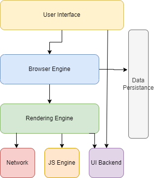

# How Browser Work
## _Browser Architecture_

Above diagram covers the main components of browser:

- UI
- Broswer Enginer
- Rendering Engine
- Networking
- Data Persistence
- JS Engine
- UI Backend

Lets Look at each component briefly:
### UI
UI consist of part of browser that interacts with User. It has Addressbar, refresh button, tabs, settings button, area where webswite is rendered, etc. UI communicates with UI Backend for rendering the inidividual components and layout.

### UI Backend
Uses OS level system libraries to render the component for website. 

### JS Engine
JavaScipt Code is parsed and executed to modify the DOM and CSSOM. Chrome uses V8 JavaScrip Engine, Firefox uses SpiderMonkey Engine, Safari uses JavaScript Core.

### Networking
This module is responsible for fetching html, CSS and JS code from network to rendering Engine. HTML and CSS code are fetched independent of each other. JS Code is Rendered after HTML and CSS as JS code will modify the output of HTMLS and CSS rendered tree.

### Rendering Engine
Rendering Engine first creates a skeleton of webpage by rendering HTML code. Parallely renders CSS code to create CSSOM then applies to DOM. Combination of DOM and CSSOM is called Rendered Tree. Then Rendering Engine goes to UI Backed for construction and layout of different component to display on UI. 
Entire process that rendering engine goes through is called critical rendering path.

##### Examples of rendering engine include:
Safari - WebKit Rendering Engine
Chrome - Blink Rendering Engine (Blink is a fork of WebKit)
FireFox - Gecko Rendering Engine

### Browser Engine
Communicates to Rendering Engine, UI and Data Persistence.

### Data Persistence
To store data like cookies and caches this module is used. Modern browsers also support localStorage, IndexedDB and File System.

